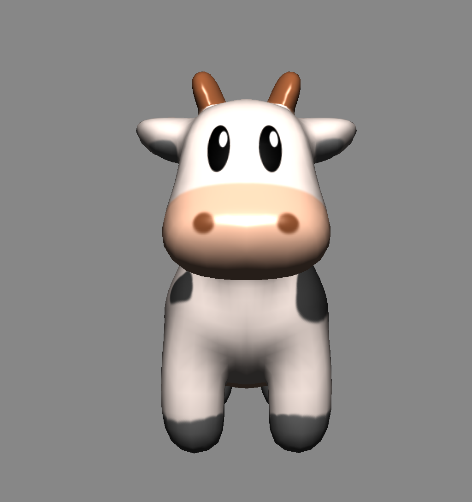
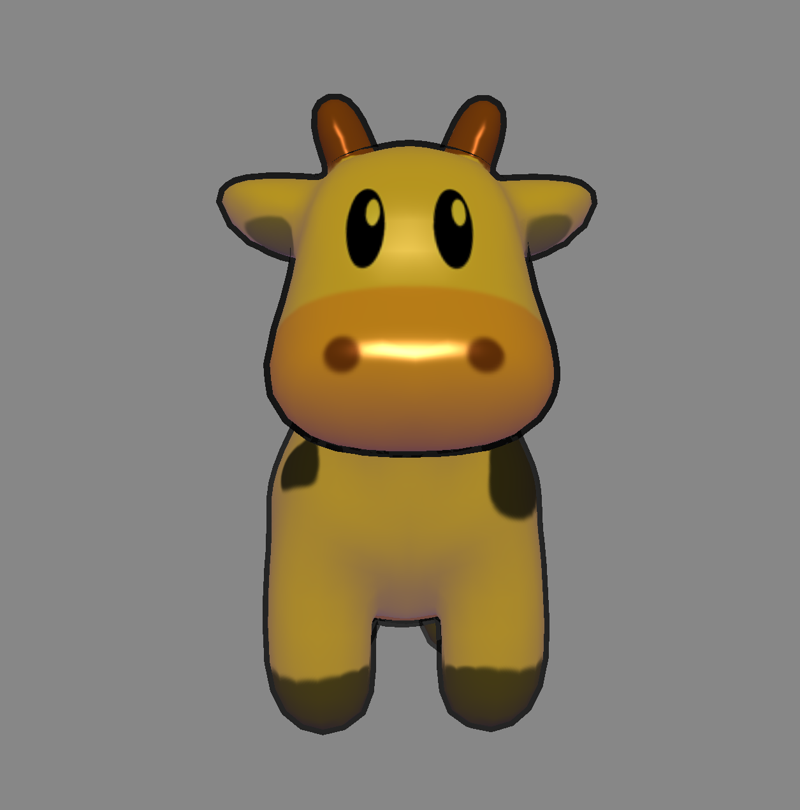
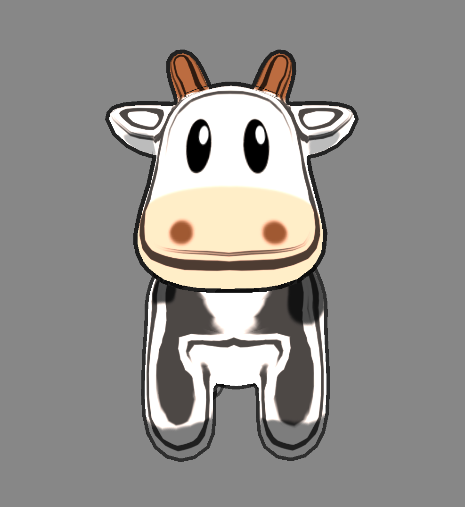
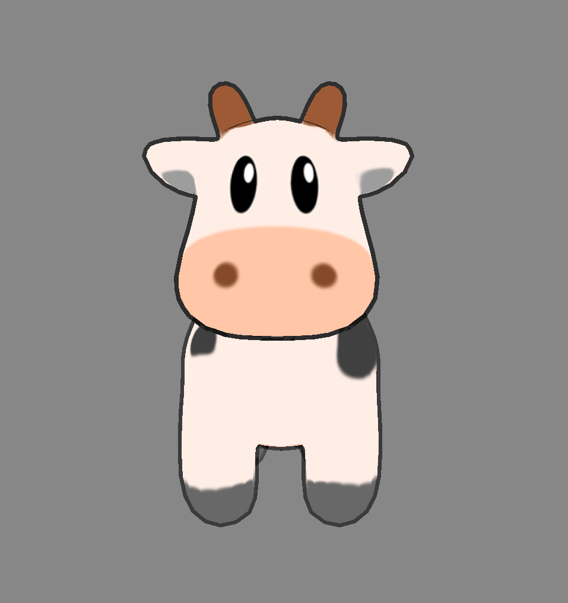
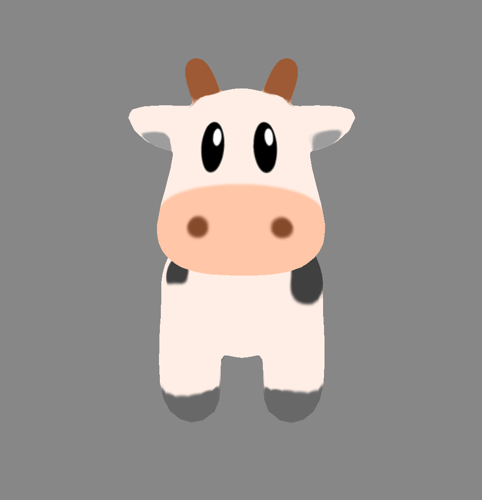
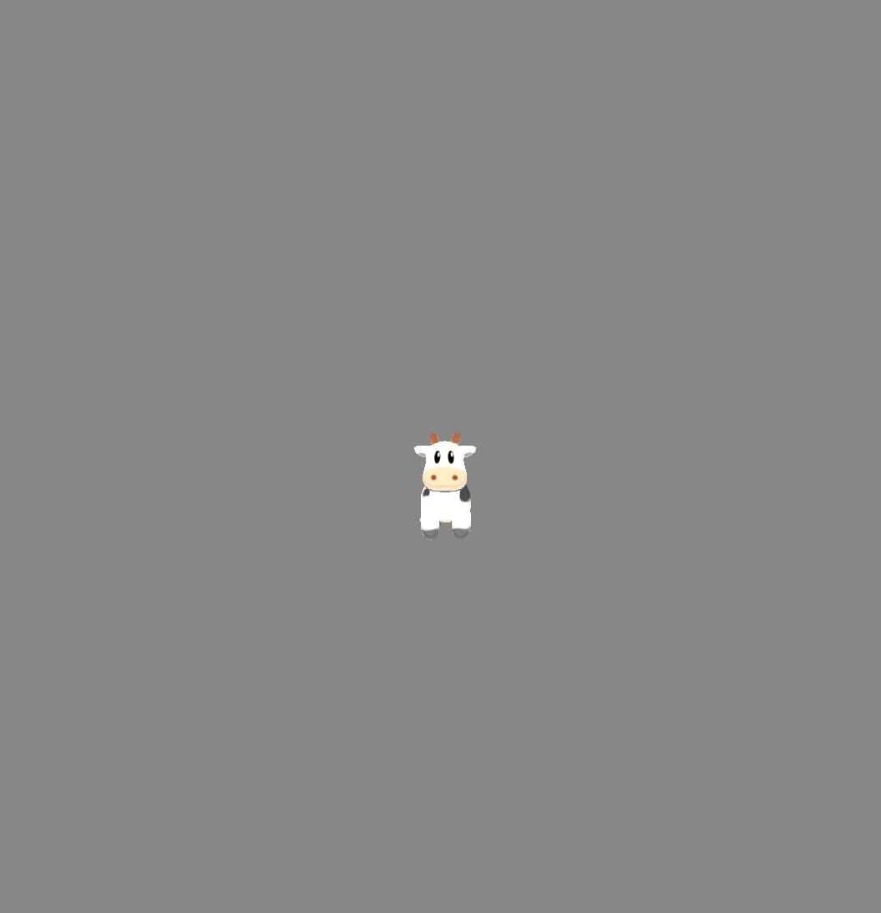

# X-Toon Extended: Real-Time Stylized Rendering with Depth-Aware Silhouettes

Author: Alice Kim | SBU ID: 115919639 | Email: jaeyoung.kim.1@stonybrook.edu  
Course: CSE 328 Computer Graphics, Stony Brook University | Professor: Hong Qin  
Platform: macOS Apple Silicon, OpenGL 3.3 Core Profile  

---

## Project Summary

This project is a real-time C++ OpenGL non-photorealistic rendering application for comparing several stylized shading models on a textured 3D character model. The program loads the Spot model using Assimp, renders it through an OpenGL 3.3 Core Profile pipeline, and allows runtime switching between Phong, Gooch, X-Toon, 1D toon, and unlit shading modes.

The main extension is a depth-aware silhouette pass based on Shin (2006). Gooch, X-Toon, and 1D toon modes use a two-pass rendering pipeline: first an inverted hull silhouette shell, then the selected surface shading model. The silhouette alpha fades with camera distance using the same near and far distance range as the X-Toon depth parameter.

Shader changes do not require make — only re-run ./xtoon

---

## Key Features

- Real-time OpenGL rendering with GLFW, GLAD, GLM, Assimp, and stb_image
- Textured Spot model loaded from OBJ/MTL assets
- Runtime shader mode switching with keyboard controls
- Phong baseline shader
- Gooch warm/cool technical illustration shader
- X-Toon 2D ramp shader using light direction and camera distance
- 1D toon ramp shader using light direction only
- Unlit texture preview shader
- Inverted hull silhouette rendering for stylized outline modes
- Shin (2006) depth-faded silhouette alpha using camera distance

---

## Build Instructions

### Dependencies

- OpenGL
- GLFW
- GLM
- Assimp
- CMake

Install dependencies with Homebrew. If CMake is already installed on your system, you can omit `cmake` from this command:

```bash
brew install cmake glfw glm assimp
```

GLAD and stb_image are included in src/ — no install needed.

Build: 
mkdir build && cd build → cmake .. → make → ./xtoon

Equivalent terminal commands:
```bash
mkdir build
cd build
cmake ..
make
./xtoon
```

Notes:

- Run the executable from the `build` directory so relative paths such as `../shaders`, `../textures`, and `../models` resolve correctly.
- Shader changes do not require make — only re-run ./xtoon

---

## Running

After building, run the executable from the `build` directory:

```bash
cd build
./xtoon
```

If you edit only shader files, you do not need to rebuild. Just re-run `./xtoon` from the `build` directory.

The application opens a `1200 x 800` window titled `NPR Shaders` and starts in Phong mode.

---

## Controls Table

| Input | Action |
|---|---|
| `1` | Switch to Phong shading |
| `2` | Switch to Gooch shading |
| `3` | Switch to X-Toon shading |
| `4` | Switch to 1D toon shading |
| `5` | Switch to unlit shading |
| `W` | Move camera forward |
| `S` | Move camera backward |
| `A` | Move camera left |
| `D` | Move camera right |
| Mouse movement | Rotate camera view |
| Scroll up | Move camera forward |
| Scroll down | Move camera backward |
| `Esc` | Close the window |

---

## Scene Parameters

These values apply across every shading mode and are set in `src/main.cpp`.

| Parameter | Value |
|---|---|
| Window size | `1200 x 800` |
| Background clear color | `(0.53, 0.53, 0.53)` mid-gray |
| Initial camera position | `(0.0, 0.5, 4.0)` |
| Shared light position | `(0.0, 2.0, 3.0)` |
| Model rotation | `180°` around the Y axis |
| Projection | Perspective, FOV from `camera.Zoom` (default `45°`), near `0.1`, far `100.0` |

---

## Shading Modes

### Phong

Files:

- `shaders/phong.vert`
- `shaders/phong.frag`

Runtime key: `1`

Parameters from the code:

| Parameter | Value |
|---|---|
| `lightPos` | `(0.0, 2.0, 3.0)` |
| `lightColor` | `(1.0, 1.0, 1.0)` white |
| `objectColor` | `(0.7, 0.5, 0.3)` warm brown |
| `ambientStrength` | `0.15` |
| `specularStrength` | `0.6` |
| `shininess` | `32.0` |
| `useTexture` | `true` |
| Cull face | `GL_BACK` |

This mode uses ambient, diffuse, and specular Phong lighting with the Spot diffuse texture.



### Gooch

Files:

- `shaders/phong.vert`
- `shaders/gooch.frag`
- `shaders/outline.vert`
- `shaders/outline.frag`

Runtime key: `2`

Surface shader parameters from the code:

| Parameter | Value |
|---|---|
| `lightPos` | `(0.0, 2.0, 3.0)` |
| `objectColor` | `(0.7, 0.5, 0.3)` warm brown |
| `alpha` | `0.45` |
| `beta` | `0.45` |
| `k_blue` | `(0.0, 0.0, 0.4)` dark blue (hardcoded in `gooch.frag`) |
| `k_yellow` | `(0.4, 0.4, 0.0)` dark yellow (hardcoded in `gooch.frag`) |
| Specular exponent | `32.0` (hardcoded in `gooch.frag`) |

Outline pass parameters from the code:

| Parameter | Value |
|---|---|
| `outlineThickness` | `0.015` |
| `nearDist` | `2.0` |
| `farDist` | `8.0` |
| Blend function | `GL_SRC_ALPHA, GL_ONE_MINUS_SRC_ALPHA` |
| Outline cull face | `GL_FRONT` |
| Surface cull face | `GL_BACK` |

This mode renders a depth-faded black outline first, then applies Gooch warm/cool shading multiplied by the Spot texture.



### X-Toon

Files:

- `shaders/phong.vert`
- `shaders/xtoon.frag`
- `shaders/outline.vert`
- `shaders/outline.frag`
- `textures/xtoon_ramp.png`

Runtime key: `3`

Surface shader parameters from the code:

| Parameter | Value |
|---|---|
| `lightPos` | `(0.0, 2.0, 3.0)` |
| `nearDist` | `2.0` |
| `farDist` | `8.0` |
| Ramp texture | `textures/xtoon_ramp.png` |
| Ramp size | `256 x 256` |
| Minimum toon light | `0.25` (hardcoded in `xtoon.frag`) |
| Final light scale | `1.2` (hardcoded in `xtoon.frag`) |

Outline pass parameters from the code:

| Parameter | Value |
|---|---|
| `outlineThickness` | `0.015` |
| `nearDist` | `2.0` |
| `farDist` | `8.0` |
| Blend function | `GL_SRC_ALPHA, GL_ONE_MINUS_SRC_ALPHA` |
| Outline cull face | `GL_FRONT` |
| Surface cull face | `GL_BACK` |

This mode samples a 2D X-Toon ramp. The horizontal coordinate is the remapped normal-light dot product, and the vertical coordinate is the camera-distance detail parameter `D`.



### 1D Toon

Files:

- `shaders/phong.vert`
- `shaders/toon1d.frag`
- `shaders/outline.vert`
- `shaders/outline.frag`
- `textures/toon1d_ramp.png`

Runtime key: `4`

Surface shader parameters from the code:

| Parameter | Value |
|---|---|
| `lightPos` | `(0.0, 2.0, 3.0)` |
| Ramp texture | `textures/toon1d_ramp.png` |
| Ramp size | `256 x 4` |
| Ramp sample coordinate | `(u, 0.5)` (hardcoded in `toon1d.frag`) |
| Minimum toon light | `0.25` (hardcoded in `toon1d.frag`) |
| Final light scale | `1.0` (hardcoded in `toon1d.frag`) |

Outline pass parameters from the code:

| Parameter | Value |
|---|---|
| `outlineThickness` | `0.015` |
| `nearDist` | `2.0` |
| `farDist` | `8.0` |
| Blend function | `GL_SRC_ALPHA, GL_ONE_MINUS_SRC_ALPHA` |
| Outline cull face | `GL_FRONT` |
| Surface cull face | `GL_BACK` |

This mode samples a 1D toon ramp using the remapped normal-light dot product and multiplies the result by the Spot texture.



### Unlit

Files:

- `shaders/phong.vert`
- `shaders/unlit.frag`

Runtime key: `5`

Parameters from the code:

| Parameter | Value |
|---|---|
| Texture sampler | `texture_diffuse1` |
| Cull face | `GL_BACK` |

This mode displays the Spot diffuse texture without lighting.



---

## Extension: Shin (2006) Depth-Faded Silhouettes

This is an extension from Shin, J. (2006), A Stylised Cartoon Renderer for Toon Shading of 3D Character Models, MSc Thesis, University of Canterbury. Specifically Equation 4.10 — silhouette alpha fades with camera distance. nearDist=2.0 and farDist=8.0 match the X-Toon D parameter range exactly, creating a unified depth-aware pipeline.

The implementation uses the inverted hull method. The outline vertex shader expands the mesh along its normals by `outlineThickness = 0.015`, and the outline fragment shader fades alpha based on the distance between the fragment world position and camera position.

GLSL snippet from `shaders/outline.frag`:

```glsl
#version 330 core

in vec3 FragPos;

uniform vec3 viewPos;
uniform float nearDist;
uniform float farDist;

out vec4 FragColor;

void main()
{
    float dist = length(FragPos - viewPos);
    float fade = 1.0 - clamp((dist - nearDist) / (farDist - nearDist), 0.0, 1.0);
    //SOLID black for outline
    FragColor = vec4(0.0, 0.0, 0.0, fade);
}
```

The same `nearDist = 2.0` and `farDist = 8.0` values are also used by the X-Toon shader for its distance parameter `D`, so the silhouette abstraction and X-Toon abstraction change over the same camera-distance interval.

| Camera near `nearDist` | Camera near `farDist` |
|---|---|
|  |  |

---

## Known Limitations

Interior connecting edges (e.g. Spot's chin/body boundary) fade at the same rate as boundary edges, causing minor disconnection at far distances. This is inherent to the inverted hull method. Future fix would be the Sobel G-Buffer approach from Shin (2006) Section 4.2.

Additional limitations visible in the current code:

- Projection aspect ratio uses the initial `1200 / 800` window size, so resizing the window updates the viewport but not the projection aspect ratio.
- Shader and asset paths are relative to the `build` directory.

---

## Features Implemented

- [x] OpenGL 3.3 Core Profile window creation with GLFW
- [x] GLAD OpenGL function loading
- [x] Camera movement with keyboard, mouse, and scroll input
- [x] Assimp OBJ model loading
- [x] Spot model diffuse texture loading
- [x] Phong shading mode
- [x] Gooch shading mode
- [x] X-Toon 2D ramp shading mode
- [x] 1D toon ramp shading mode
- [x] Unlit texture mode
- [x] Runtime shader switching with keys `1` through `5`
- [x] Inverted hull outline pass
- [x] Shin (2006) depth-faded silhouette alpha
- [x] Shared `nearDist = 2.0` and `farDist = 8.0` range for silhouette fade and X-Toon distance abstraction

---

## File Structure

```text
.
├── CMakeLists.txt
├── README.md
├── docs/
│   └── screenshots/
│       ├── SpotOutlines.png
│       ├── Phong/
│       │   ├── PhongSpot.png
│       │   └── PhongSpotSide.png
│       ├── Gooch/
│       │   ├── GoochSpot.png
│       │   └── GoochSpotBack.png
│       ├── XToon/
│       │   ├── XtoonSpotClose.png
│       │   └── XtoonSpotFar.png
│       ├── 1dToon/
│       │   ├── Spot1dToon.png
│       │   └── Spot1dToonSide.png
│       └── Unlit/
│           ├── SpotUnlit.png
│           ├── SpotUnlit2.png
│           ├── SpotUnlit3.png
│           └── SpotUnlit4.png
├── models/
│   └── spot/
│       ├── README.txt
│       ├── spot_control_mesh.obj
│       ├── spot_quadrangulated.obj
│       ├── spot_triangulated.mtl
│       ├── spot_triangulated.obj
│       ├── spot_texture.png
│       └── spot_texture.svg
├── shaders/
│   ├── gooch.frag
│   ├── outline.frag
│   ├── outline.vert
│   ├── phong.frag
│   ├── phong.vert
│   ├── toon1d.frag
│   ├── unlit.frag
│   └── xtoon.frag
├── src/
│   ├── KHR/
│   │   └── khrplatform.h
│   ├── glad/
│   │   └── glad.h
│   ├── camera.h
│   ├── glad.c
│   ├── mesh.h
│   ├── model.h
│   ├── shader.h
│   ├── stb_image.cpp
│   └── stb_image.h
└── textures/
    ├── toon1d_ramp.png
    └── xtoon_ramp.png
```

Generated build files are stored in `build/` after running CMake.

---

## References

[1] Phong, B.T. (1975). Illumination for computer generated pictures. Communications of the ACM, 18(6), 311–317.

[2] Gooch, A., Gooch, B., Shirley, P., & Cohen, E. (1998). A non-photorealistic lighting model for automatic technical illustration. SIGGRAPH 1998.

[3] Lake, A., Marshall, C., Harris, M., & Blackstein, M. (2000). Stylized rendering techniques for scalable real-time 3D animation. NPAR 2000.

[4] Barla, P., Thollot, J., & Markosian, L. (2006). X-Toon: An extended toon shader. NPAR 2006.

[5] Shin, J. (2006). A stylised cartoon renderer for toon shading of 3D character models. MSc Thesis, University of Canterbury.
